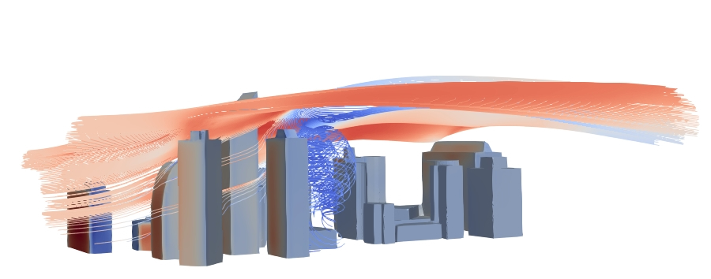

- - - 
* Table of Content
{:toc}
- - - 

# Fix the mess we made

Within this assignment you have a CFD case [here](https://surfdrive.surf.nl/s/2KDHFDmPxRQETt9). Unfortunately, we do not know why but the case seems to be messed up and it does not run properly, could you help us find the mistakes within the case? Our intention was to run a neutral atmospheric boundary layer case within a urban environment (no temperature involved).

To accomplish this task you can use the class notes, the additional resources and the tutorials freely available from [OpenFOAM](https://www.openfoam.com).

## AI guidance

- Only AI to support coding for plots with python/paraview is allowed in this assignment

## Assignment

Within the first part of the assignment you should fix the mistakes, and make sure the case runs properly (questions 1-2). Then you will need to read the following article (and the materials given through class) to reply to questions 3-4 https://doi.org/10.1016/j.buildenv.2015.02.015. If needed, you can assume z0=0.1m and that the velocity specified in the case was at 10m height. 

To complete this assignment you will need to:

1. Identify 4 mistakes within the case (3 points). Note: these are not format mistakes, but mistakes that make the case incorrectly set-up with the physical solution goal of your case
2. Explain how you fixed those mistakes to run the case (3 points)
3. Following the tips within the paper (and the course classes): 
	- Is the domain size for the simulation appropriate? (0.5pts)
	- What would be the minimum and maximum domain size? (0.5pts)
4. Following the tips within the paper (and the course classes): 
	- Is the case converged? (0.5 pts)
	- How can you check and prove that? (1 pts)
	- If it is not converged, what can you do to fix that? (0.5 pts)
5. Can you prove that the ABL profile is mantained along the domain? why?
	- Proof (0.5pts)
	- Explanation (0.5pts)

## Rubric

{:class="table table-responsive table-sm table-hover"}
| Questions  |  |  |  |  |  Total|
--- | --- | --- | --- | --- | ---
|Q.1 |0.75|1.5|2.25|3|3|
|what did the student do?|identified 1 mistake|identified 2 mistakes|identified 3 mistakes|identified 4 mistakes|
|Q.2 |0.75|1.5|2.25|3|3|
|what did the student do?|explained and fixed 1 mistake|explained and fixed 2 mistakes|explained and fixed 3 mistakes|explained and fixed 4 mistakes|
|Q.3 |0.5|0.5|||1|
|what did the student do?|explained the domain size design guidelines|computed the correct domain size minimum and maximum (0.5)|
|Q.4 |0.5|1/1.5|2||2|
|what did the student do?|explained if the case is converged|previous question and proved that the case is converged through 1/2 ways| fixed if needed|
|Q.5 |0.5|1|||1|
|what did the student do?|shows plots to check acceleration|correctly explains why it happens or not| |

## Deliverables

You have two deliverables that need to be submitted before the deadline [here](https://surfdrive.surf.nl/s/BtPmoAGQQ6QrJQD). Please submit it in a compressed format file:

1. Short report replying to questions and reasoning your choices (*.pdf).
2. Fixed case with just folders 0,constant,system

[last updated: 2026-09-09 14:37]
