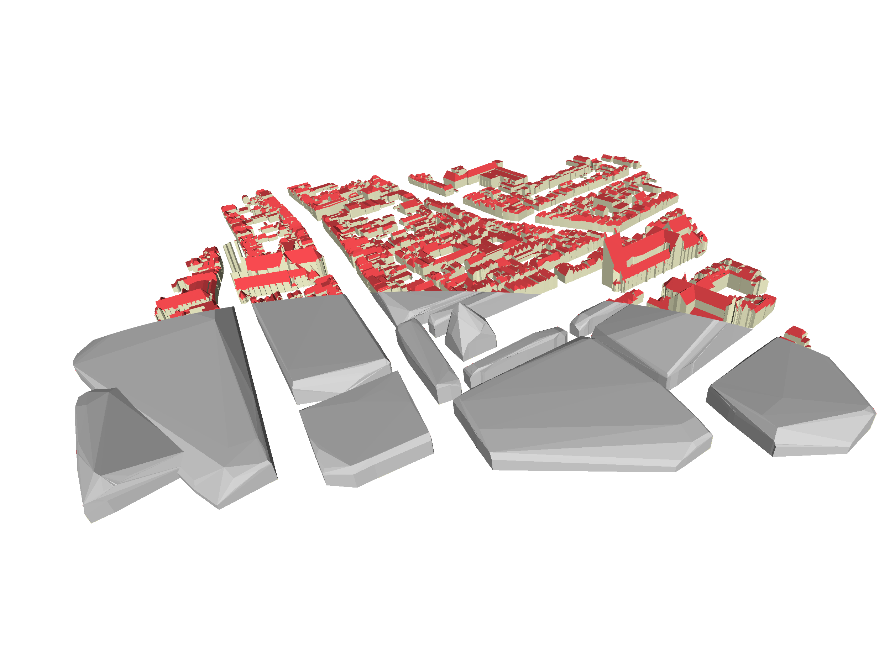

- - - 
* Table of Content
{:toc}
- - - 

## Overview

For this assignment you will implement a method to simplify a 3D city model by merging neighbouring buildings into blocks. This method will involve the following steps:

1. read the triangles in the input 3D city model from an OBJ file and load it into a data structure;
2. for each triangle, compute its (expanded) bounding box;
3. use the bounding boxes to find pairs of neighbouring triangles;
4. assign groups of neighbouring triangles to blocks;
5. in each block, store all the points of its triangles' vertices;
6. for each block's points, compute its convex hull;
7. extract the triangles from each block's convex hull;
8. output the triangles to an OBJ file.

You will hand in the program and a very short report that explains what you did and evaluates how well this method works.

## How to get started

[`hw1.cpp`](https://3d.bk.tudelft.nl/courses/geo1004/data/hw1.cpp) is a skeleton of code to help you. For the input data, your code should be able to simplify OBJ files structured like those in the [3D BAG](https://3dbag.nl/). The image as the top of the page shows the results of my code with tile [10-282-562](https://3dbag.nl/en/download?tid=10-282-562). You can use the image at the top of this page as a reference for how your output should look.

You are free to modify the provided `hw1.cpp` code as you see fit or to avoid it using entirely. Note that this file contains code that does parts of some of the steps for you, as well as:

1. A good set of CGAL headers and definitions for your code.
2. A data structure `Face` that can store an input triangle's ID, geometry, material, IDs of its neighbours, and the ID of the block it belongs to.
3. A data structure `Block` that can store a block's points, convex hull, and min/max z values. 

This assignment needs to be implemented in C++. You can use any functions in the C++ standard library or in CGAL. Most of the CGAL types you care about are part of the package [2D and 3D Linear Geometry Kernel](https://doc.cgal.org/latest/Kernel_23/group__PkgKernel23Ref.html).

## 1. OBJ?

The first step is to read the input OBJ file into memory. If you're not familiar with the OBJ file format, see [this](https://en.wikipedia.org/wiki/Wavefront_.obj_file) Wikipedia article. You can use [MeshLab](https://www.meshlab.net/) or [Blender](https://www.blender.org/) to visualise OBJ files. Some Windows versions and all recent macOS versions come with OBJ viewers, but these aren't as good as MeshLab.

## 2-3. Expanded bounding boxes?

Our method is based on the fact that if two buildings A and B are neighbours, there should be a triangle from A and a triangle from B that are also neighbours.
Therefore, the method will try to identify pairs of neighbouring triangles, but we want to do this in a way that: (i) is fast, and (ii) also detects buildings that are very close but not touching each other.

Because of (i), we will use CGAL's package [Intersecting Sequences of dD Iso-oriented Boxes](https://doc.cgal.org/latest/Box_intersection_d/index.html#Chapter_Intersecting_Sequences_of_dD_Iso-oriented_Boxes), which uses axis-aligned bounding boxes to efficiently check for intersections.
Then, in order to deal with (ii), we will slightly expand each triangle's axis-aligned bounding box using a distance threshold.
This calculation can be done in 2D or 3D (your choice), but the code skeleton provided assumes it is done in 3D.

## 4. Assigning triangles to blocks

The code assigns block IDs to each triangle by following the links between pairs of identified intersections between the triangles' bounding boxes. Groups of interlinked triangles form a block.

## 5-6. Getting each block's 3D convex hull

Assuming each block's points are loaded into a data structure, you should use CGAL to compute their [3D convex hull](https://doc.cgal.org/latest/Convex_hull_3/index.html).

## 7-8. Creating and writing the output triangles

You should create individual triangles from the all the blocks' convex hulls.
Note that the triangles should be correctly oriented (i.e. normal pointing outwards).

Finally, write these triangles to an OBJ file.
This file can include materials if you want, but it is not necessary.

## Debugging, testing and reporting

In order to develop and debug your code, feel free to use the lines that are commented out in `hw1.cpp`. Your IDE's debugger can also help. If you're having trouble with CGAL's data structures, try writing partial results to the console or creating OBJ output from intermediate results. Another good strategy is to create a simple input OBJ and move on to increasingly complex ones.

You should test your code with different OBJ files from the 3D BAG. Also try different LoDs (i.e. the different OBJ files in a tile's ZIP file). Based on these tests, identify issues with the method and evaluate how well the method works (qualitatively and quantitatively). Your code doesn't need to be perfect but you should be aware of the issues in it.

You need to submit a simple report in PDF outlining your work. It should explain at a high level (not line by line) how your code works, particularly the parts of the code that were not provided. Include instructions to run your code, the issues you identified and your evaluation of the method.

I expect maximum 4 pages for the report (figures and tables included). Don't forget to write your names, specify if/how you divided the work and make sure you document if/how you used any AI or any form of external help.

## Marking

In order to mark your assignment, I will:
* run your code with LoD 2.2 of tile `10-282-562` and evaluate the results
* read your report.

{:class="table table-responsive table-sm table-hover"}
| Criterion     | Points | 
|---------------|-------:| 
| code runs without modifications | 2 |
| code simplifies tile `10-282-562` correctly | 4 |
| report | 4 |

Note that submissions that do not follow the instructions (e.g. reports that are too long or not in PDF) will be penalised.

## Deliverables

You have to submit a ZIP file (or another compressed format) with the following files:

1. Your source code (everything that is needed to run/compile it).
1. Your report in PDF.

Do *not* submit your assignment by email, but use this [Dropbox link](https://www.dropbox.com/request/hr3150h17x5hgzv9t9w3).

[last updated: 2026-04-18 14:37]