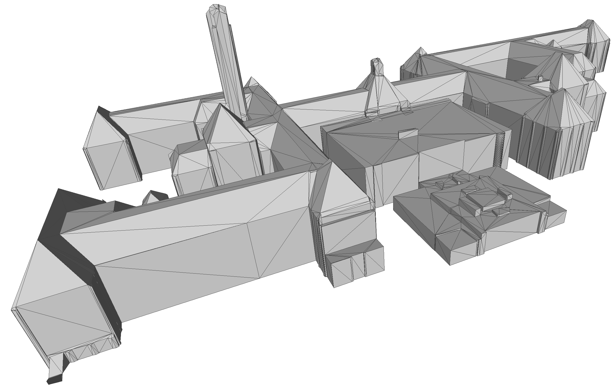
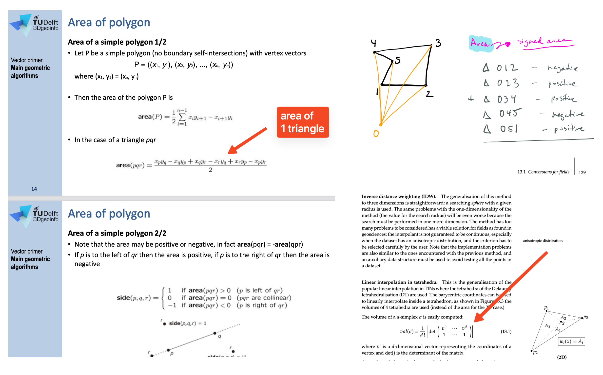

- - - 
* Table of Content
{:toc}
- - - 


## Overview

In its current form, the [3DBAG dataset](https://3dbag.nl) contains for each of the ~11M buildings in the Netherlands: 
  1. the 3D geometry at three [LoDs](https://3d.bk.tudelft.nl/lod/): 1.2+1.3+2.2
  2. several attributes, e.g. the construction year, the height of the ground, the type of roof, current status of the building, etc.

For this assignment, you are asked to modify/manipulate the 3DBAG and add some attributes that are useful in practice. 
Given one tile of the 3DBAG, your programme should do the following:

  1. keep only the LoD2.2 (and remove other LoDs in the file)
  1. put the LoD2.2 geometry into its parent `"Building"` (and delete the `"BuildingPart"`)
  1. **triangulate** the geometry (and update all parts related, e.g. semantic surfaces)
  1. calculate the **volume** of the LoD2.2 geometry and add it as attribute
  1. calculate the **total area** of the roofs and add it as attribute

The updated model must be delivered in the [CityJSON](https://www.cityjson.org) format (v2.0).


## Your code should be able to read any 3DBAG file as input

The 3DBAG, developed by the [3D geoinformation group at TU Delft](https://3d.bk.tudelft.nl) and by [3DGI](https://3dgi.nl) (and also the topic of Lesson 7.1), is a dataset containing 3D models of all the buildings in the Netherlands. 
The 3DBAG is open data and it contains 3D models at multiple levels of detail (LoDs), which are generated by combining two open datasets: the building data from the [BAG](https://www.kadaster.nl/zakelijk/registraties/basisregistraties/bag) and the height data from the [AHN](http://www.ahn.nl). 
The 3DBAG is updated regularly, keeping it up-to-date with the latest openly available building stock and elevation information.
More details about the 3DBAG are available on [its website](https://docs.3dbag.nl/en/).

The buildings are tiled, and you can download a tile (which typically contains a few hundred buildings).
To start, you can practice on the tile where BK-City is located: 

<a href="https://data.3dbag.nl/v20250903/tiles/9/284/556/9-284-556.city.json"><i class="fa fa-download"></i> 9-284-556.city.json</a>
{:width="400px"}


## Methodology/workflow to use

You have to use C++ and the [CGAL library](https://www.cgal.org) to do this assignment.

Your code needs to be a single binary/executable that reads one 3DBAG tile in CityJSON, and it will output a new one with the modifications applied.

You can use any packages of CGAL except the following functions, which you have to code (these are essential for the assignment and it's one learning objective to learn how to implement those yourself):

* [CGAL::area()](https://doc.cgal.org/latest/Kernel_23/group__area__grp.html)
* [CGAL::squared_area()](https://doc.cgal.org/latest/Kernel_23/group__squared__area__grp.html)
* [CGAL::determinant()](https://doc.cgal.org/latest/Kernel_23/group__determinant__grp.html)
* [CGAL::normal()](https://doc.cgal.org/latest/Kernel_23/group__normal__grp.html)
* [CGAL::volume()](https://doc.cgal.org/latest/Kernel_23/group__volume__grp.html)
* [CGAL::Polygon_mesh_processing::triangulate_face()](https://doc.cgal.org/latest/Polygon_mesh_processing/group__PMP__meshing__grp.html#ga54559e61c73ce4481f4a3374a61ca038)
* [CGAL::Polygon_mesh_processing::triangulate_faces()](https://doc.cgal.org/latest/Polygon_mesh_processing/group__PMP__meshing__grp.html#gaf094a938993d7353589a55010edf63a6)
* [CGAL::Polygon_mesh_processing::triangulate_polygons()](https://doc.cgal.org/latest/Polygon_mesh_processing/group__PMP__meshing__grp.html#ga626f12385ac7fb10125772c3786b4ea8)

(Perhaps we forgot one that is similar to those, but the idea is to learn to code those, so ask us in doubt)


### 1. Keep only LoD2.2 and merge it to its parents

In the 3DBAG, a `"Building"` has a `"lod": "0"` geometry with several attributes, and the 3 LoDs (1.2, 1.3, and 2.2) are in its child `"BuildingPart"`.

For your programme, you need to delete all LoDs except LoD2.2, which you move to its parent.
The `"BuildingPart"` should be deleted.


### 2. Triangulation of the surfaces

We refer to a triangulation of the surfaces of the buildings, not a volumetric triangulation.

Since you may not use CGAL's `triangulate_face()` / `triangulate_faces()` / `triangulate_polygons()` functions, you must implement the triangulation yourself.
We recommend the following approach (since it works for polygons with holes):

1. For each polygon (surface) of the building's LoD2.2 geometry, compute its best-fitting plane using [principal component analysis](https://doc.cgal.org/latest/Principal_component_analysis/index.html#title6).
2. Project the polygon's vertices to 2D using that plane (CGAL's [`Plane_3::to_2d()`](https://doc.cgal.org/latest/Kernel_23/classCGAL_1_1Plane__3.html)).
3. Create a [constrained 2D triangulation](https://doc.cgal.org/latest/Triangulation_2/classCGAL_1_1Constrained__triangulation__2.html) containing all of the polygon's edges as constraints.
4. Label each triangle of the 2D triangulation as interior or exterior using the **odd-even rule**: starting from the [infinite face](https://doc.cgal.org/latest/Triangulation_2/index.html#title2) (which is exterior), traverse neighbours; crossing an odd number of constraints means interior, an even number means exterior.
5. Extract the interior triangles back to 3D using the plane's [`to_3d()`](https://doc.cgal.org/latest/Kernel_23/classCGAL_1_1Plane__3.html).

Observe that the orientation must be preserved, and validity (with [val3dity](https://github.com/tudelft3d/val3dity/)) must be maintained: if a LoD2.2 geometry is valid in the input file, it should also be valid in the output file.


### 3. Volume 

You have to calculate the volume of each `"Building"` (their LoD2.2 geometry) and this value needs to stored as a new attribute called `"geo1004_volume"`).

If $$E$$ is the exterior boundary/envelope of a building, then we define its volume by $$Vol(E)$$.

You have to implement the method yourself, you are thus **not** allowed to use an off-the-shelf solution that you find somewhere or the CGAL::volume() functions.

Moreover, we prescribe the method that needs to be used, which is a generalisation of the method that you learned in GEO1002.
You need to decompose the solid of the building into tetrahedra, and sum the (signed) volume of each.

{:width="600px"}

Observe that the 3DBAG (which you use) already has an attribute [`b3_volume_lod22`](https://docs.3dbag.nl/en/schema/attributes/#b3_volume_lod22); I guess your aim is to verify that those values are correct.


### 4. Total area of the RoofSurfaces

Also, for each `"Building"`, you need to add one attribute (called `"geo1004_total_roof_area"`) that gives the total area, in square metres, of the surfaces with semantics `"RoofSurface"`.


## Requirements for the program

It should take one argument (the input CityJSON file), and output in the same folder as the file a new file called where `_out` is added before `.city.json` (so `myfile.city.json` becomes `myfile_out.city.json`).

The [demo code for hw02](https://gitlab.tudelft.nl/3d/geo1004.2026) shows how this can be done; feel free to use that code and modify it.
You can also start from scratch, it's up to you.


## Requirements for the CityJSON output

1. use CityJSON version 2.0
1. the file you produce must be valid according to the CityJSON schema v2.0 [(use `cjval` to verify this)](https://validator.cityjson.org).
1. The only difference allowed is that the order of the properties doesn't need to be the same since your library might not allow you to have control over this.
1. Be careful about the types and names of the attributes, they are shown below.

## Some tips

* You need to consider that the buildings in a 3D city model will sometimes not be geometrically valid ([in the wild, they seldom are in practice](https://doi.org/10.5194/isprs-annals-IV-2-W1-13-2016)), and you cannot assume so. So, your algorithms must deal with this (and not crash because of invalid input).
* the CityJSON file you read as input will be syntactically valid and of version 2.0, and always be structured as the 3DBAG files (with 3 LoDs).
* the validator [cjval](https://github.com/cityjson/cjval) can be used locally to verify the syntax of the files you create, it's faster and simpler to use than the web-app.
* you can verify that your area and volume calculations are correct with different tools, but MeshLab is probably the simplest: `Filters / Quality Measure and Computations / Compute Geometric/Topological Measures`.
* You can visualise your files (geometry + attributes) using [ninja.cityjson.org](https://ninja.cityjson.org/), QGIS (using the [CityJSON Loader plugin](https://plugins.qgis.org/plugins/CityJSON-loader/)), or [azul](https://github.com/tudelft3d/azul) (macOS only).
* To view and understand errors it's best to use [CJLoupe](https://3dgi.github.io/CJLoupe/).
* CGAL has many packages that can be of great help: explore!


## Report

The short report should only discuss, for each of the parts (triangulation, area, and volume), the algorithm you used, the engineering decisions you took (why did you do it this way or not another way?), and the difficulties/issues you faced and how you solved them.
And add a short section who-did-what (we will check the commits also).

We expect a report of about 4 pages max (including figures).


## Marking

{:class="table table-responsive table-sm table-hover"}
| Criterion     | Points | 
|---------------|-------:| 
| report (quality/readability/etc)  | 2 |
| file valid + rules respected      | 1 |
| triangulation                     | 3 |
| volume                            | 2 |
| area of RoofSurfaces              | 2 |


## What to submit and how to submit it

Everything will be done with GitHub.
You have to create a **private** GitHub repository where all the code, output data, and the report go.

Before the deadline, you need to invite [@hugoledoux](https://github.com/hugoledoux), [@kenohori](https://github.com/kenohori), and [@GinaStavropoulou](https://github.com/GinaStavropoulou) as collaborators to the repository ([how to do this](https://docs.github.com/en/account-and-profile/setting-up-and-managing-your-personal-account-on-github/managing-access-to-your-personal-repositories/inviting-collaborators-to-a-personal-repository)).

After that, email me (<h.ledoux@tudelft.nl>) with (one email per team):
1. the URL of the repository, 
2. the name and student number of each member.

Do not add or modify anything after the deadline! You will get penalised for late submission.

The structure of your repository should be as follows (if you have more files before submission, just delete them from the final version please):

```
├── report
│   └── report.pdf 
│   └── (report.tex if used, if you want)
│   └── (report.docx if used, if you want)
├── data
│   └── nextbk_2b.city.json 
│   └── 9-284-556_out.city.json 
├── cpp
│   └── src/
│       └── main.cpp
│       └── (others *.cpp or *.h if needed)
│   └── include/
│       └── json.hpp
│   └── CMakeLists.txt (it should work with the code you submitted)
├── README.md
```

The `/data` folder contains the output you obtain with your code for the [3DBAG tile 9-284-556](https://data.3dbag.nl/v20250903/tiles/9/284/556/9-284-556.city.json)

In the `README.md`, add the name and student number of each of the members.


[last updated: 2026-05-13 10:57]
