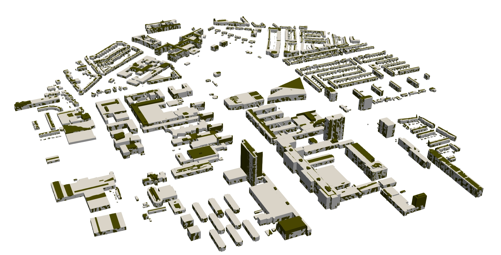

- - - 
* Table of Content
{:toc}
- - - 

# TUDelft campus and the SPAR problem

Buildings layout and organization in cities can impact the levels of pollution that surround us. Within this assignment you will have the possibility to explore the buildings effect on wind and passive scalar distributions, and how our knowledge in winds can help us to take action to improve local concentration and wind comfort.

## Learning objectives:

1. Explain the process to link the 3D city model and the simulation tool used 
2. Determine the necessary input data to simulate winds around 3D city models 
3. Apply the acquired knowledge to run two computational fluid dynamic simulations 
4. Analyse and evaluate the simulation results 
(purpose)

The assignment goal is to perform two Computational Fluid Dynamics (CFD) simulations of the flows around a real urban environment within campus, and analyze the results in terms of wind magnitude and direction at pedestrian height. Form groups of 2 people to complete the assignment. Submit only one dataset per group, name it after your surname and group number. Example: a group formed by Jan Tomel and Erika Einstein, would submit their assignment named "TomelEinstein_groupN.pdf".

## AI guidance

- Only AI to support coding for plots with python/paraview is allowed in this assignment, no AI use on thinking or coming up with alternative solutions.

## Resources

The first step to complete the assignment is to select two of the proposed geometries in the following table and mention why would you like to compare those two. 

| Case number     	| Description |
| ------------------| ----------- |
| 1     	 			| LoD1        |
| 2  					| LoD2        |
| 3     				| LoD1 with water and vegetation       |
| 4     				| LoD2 with water and vegetation       |

Here are a few more tips that might help you:
- Plot the results at point values.
- You will need the logarithmic velocity profile to derive the friction velocity ($u_*$)
- Good tutorial on snappyHexMesh commands [tutorial](https://openfoamwiki.net/images/f/f0/Final-AndrewJacksonSlidesOFW7.pdf)

## Deliverables

1. The folders with the cases set-up and last timestep (with the converged results) for as many cases as members in the group (1 case, per 1 student in the group).

2. A report describing your set-up decisions and run of the simulations, step-by-step, including the following items:
	- Decide the domain size and run two CFD simulations for the two different geometries that you have. Compare the results from those geometries. 
	- Plot the residuals for the velocity and turbulent kinetic energy.
	- Slice at 1.75m height for the velocity and the turbulence variables (k and epsilon).
	- One glyph plot of the flow around the EWI building with arrows coloured by the velocity magnitude (no scaled arrows).
	- One stream tracer plot for the field in 3D aligned with the wind direction across the EWI building. Solid color.
	- One proposal to address the turbulence level at the SPAR square at Stieltjesweg (requires an additional run to prove the result).
	
3. A short reflection explaining the role of each member within the group. Independent reflections can be directly submitted to me via email, in case of conflict. 

4. Reply to the final extra question (2.5%): how would you prove that there is conservation of mass using your simulation results? can you prove it? (2.5%)

## Instructions

Form groups of 2 people (if possible) to complete the assignment. For all the plots, you can zoom for an area of a maximum 250m from the outermost buildings. If someone does not have a group, you can join a group of 2 or submit the assignment alone. The rule is 1 simulation per person, which means if the group is 3 people, there should be 3 simulations, if the group is 1 person there should be 1 simulation. 
Other assumptions:

* Consider the flow is incompressible and temperature stratification is neutral.
* Consider the flow is steady.
* For turbulence use the k-epsilon model.
* The wind blows with velocity at height of 10m of: U = 6.0 m/s.
* The wind blows parallel to the X axis direction.

Upload to [here](https://surfdrive.surf.nl/s/wFb6PNqwif7dCjD) only one pdf report and a zip folder with the case (0, constant, system, latestTime folders) per group with the naming provided at the beginning of this document. The submission deadline is fixed to the 6th of November at 17:00. Please if you have a problem with the deadline contact me (Clara) directly through email to discuss it at least one week in advance. The minimum grade to use the assignment for average is 5.

The rubric with the grading scheme is included [here](https://surfdrive.surf.nl/s/H8zqfRZGN8aBdnE), be sure to check it out to know what each section grading entails. 

[last updated: 2026-10-02 12:00]

