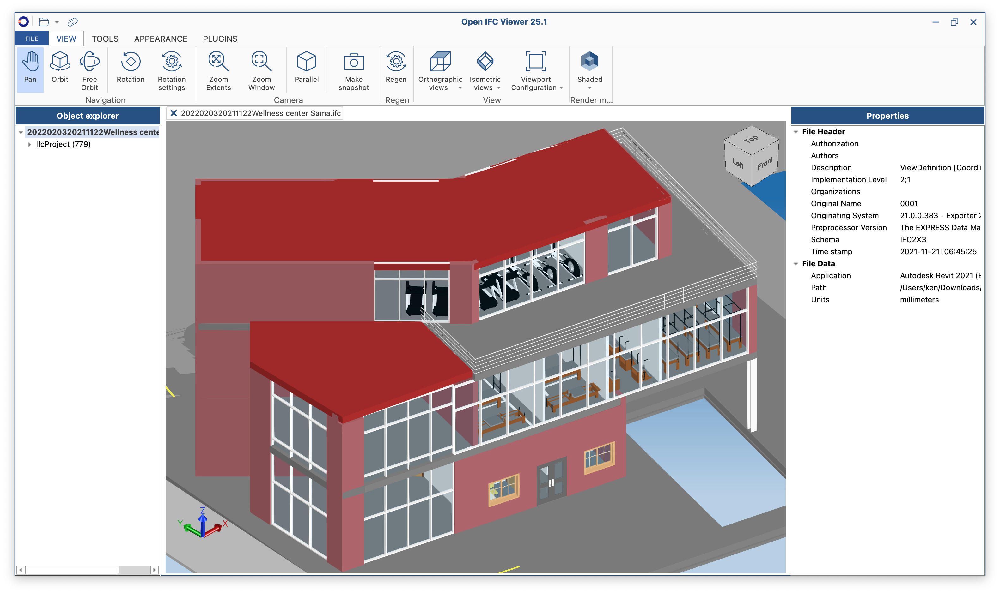
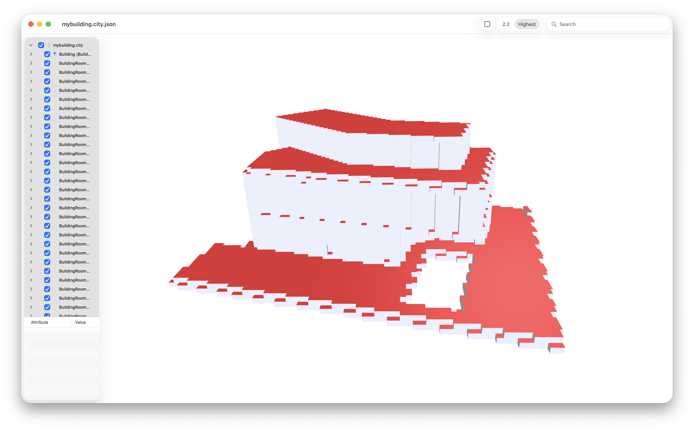
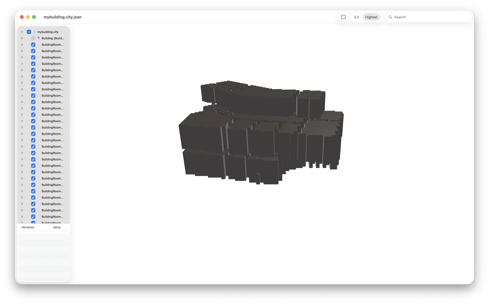

- - - 
* Table of Content
{:toc}
- - - 

## Overview

The aim of this assignment is to implement a BIM to Geo conversion for one building using voxels to extract the building's outer envelope and rooms. In short, this will involve:

1. converting the BIM model to OBJ using `IfcConvert`;
2. loading the data from the OBJ into memory;
3. creating a voxel grid covering the model;
4. voxelising the triangles from the relevant objects of the model to represent the building;
5. marking the remaining voxels as exterior and as individual rooms;
6. extracting the surfaces of the outer envelope of the building and of each room;
7. writing the building and room geometries to a CityJSON file with the correct semantics.

Everything should be implemented in C++ with the help of any packages from the [CGAL](https://www.cgal.org) library. You are also free to use any other external libraries, but only for reading and writing files, such as Niels Lohmann's [JSON for Modern C++](https://github.com/nlohmann/json) library.

## How to get started

There is no sample code to download for this lesson, but we provide some tips and code snippets in the description of each step below. You are free to use them or not.

To start developing your code, we recommend that you start with a very simple IFC file, such as the [IfcOpenHouse](https://github.com/aothms/IfcOpenHouse). This will be useful to get started and to debug your code later on. Then, move to something a bit more complex with multiple rooms, such as the [Duplex apartment](https://github.com/MadsHolten/BOT-Duplex-house/tree/master/Model%20files/IFC) model.

However, to get a full mark for the assignment, your code should be able to process a reasonably complex IFC model of your choice. In the images above, you will see the results for the [Wellness center Sama](https://openifcmodel.cs.auckland.ac.nz/api/download/2022020320211122Wellness%20center%20Sama.ifc) model from the [OpenIFC model repository](https://openifcmodel.cs.auckland.ac.nz). That's likely your best source for IFC models, but you can also find some other models in [this repository](https://github.com/opensourceBIM/TestFiles) from the developers of BIMserver or [this page](https://bimvision.eu/download/) by the developers of BIMvision. You can view the models with an IFC viewer, such as the [Open IFC Viewer](https://openifcviewer.com) or the [Bonsai](https://bonsaibim.org) add-on for [Blender](https://www.blender.org).

## 1. From IFC to OBJ

The first step is to convert the BIM model in IFC to an OBJ file (or several) containing the relevant parts of the building. It is up to you to decide which parts are relevant for the conversion.

For the conversion, you should use [`IfcConvert`](https://docs.ifcopenshell.org/ifcconvert/installation.html), which is part of the IfcOpenShell library. In order to select the relevant parts, you likely want to use the `--include` or `--exclude` options. If the filtering is not good enough, you might also want to use an option like `--use-element-names` to ensure you have access to the original element names (or something similar with IDs or materials). You can then easily process them differently from other objects.

Check out how to use the options available in `IfcConvert` by running it with the `--help` option.

## 2. From OBJ to memory

First, parse the OBJ files generated by `IfcConvert` using your own code, loading each object into memory. It's okay if you need to hardcode ignoring some objects using specific IDs, object names or materials.

In the OBJ files generated by `IfcConvert`, objects are denoted by the `g` (group) marker. These can have multiple shells, which are denoted by the `usemtl` marker. Check [this Wikipedia article](https://en.wikipedia.org/wiki/Wavefront_.obj_file) if you need help understanding the OBJ files.

You probably want to create your own simple data structures to load the data into. These could look something like this:

```
struct Shell {
  std::vector<Kernel::Triangle_3> triangles;
};

struct Object {
  std::string id;
  std::vector<Shell> shells;
};

std::map<std::string, Object> objects;
```

## 3. The voxel grid

This part is quite straightforward: define a voxel grid that covers the whole building with a customisable resolution. Make the voxel grid at least one voxel bigger than necessary in all directions (such that all the voxels on the boundary of the grid are empty). This will make the method described in step 5 possible. 

For the resolution, voxels of around 0.5 meters should be a good number to start, but you might want to reduce this value later to get a better looking result.

You'll also likely want to create a data structure to store your voxel grid. If you want, here's one simple data structure that you could use as a starting point:

```
struct VoxelGrid {
  std::vector<unsigned int> voxels;
  unsigned int max_x, max_y, max_z;
  
  VoxelGrid(unsigned int x, unsigned int y, unsigned int z) {
    max_x = x;
    max_y = y;
    max_z = z;
    unsigned int total_voxels = x*y*z;
    voxels.reserve(total_voxels);
    for (unsigned int i = 0; i < total_voxels; ++i) voxels.push_back(0);
  }
  
  unsigned int &operator()(const unsigned int &x, const unsigned int &y, const unsigned int &z) {
    assert(x < max_x);
    assert(y < max_y);
    assert(z < max_z);
    return voxels[x + y*max_x + z*max_x*max_y];
  }
  
  unsigned int operator()(const unsigned int &x, const unsigned int &y, const unsigned int &z) const {
    assert(x < max_x);
    assert(y < max_y);
    assert(z < max_z);
    return voxels[x + y*max_x + z*max_x*max_y];
  }
};
```

If you choose to use it, you can create a voxel grid easily: `VoxelGrid my_building_grid(rows_x, rows_y, rows_z)`. Note that it also has a function to access and modify the value of a specific voxel (as `unsigned int v = my_building_grid(x,y,z)` or `my_building_grid(x,y,z) = 1`).

In addition, you'll likely want to create functions to translate from the model's coordinates to the (integer) coordinates of the voxel grid and vice versa.

## 4. Voxelisation of triangles

In this step, you should voxelise the model by marking all voxels that are occupied by a relevant entity of the model with an ID. The same ID for all elements should be enough, but you can also use special IDs for different entity types (eg windows and doors).

A good method to voxelise 3D models made of triangles is discussed in the voxelisation chapter of the book.
With this method, you will have to test whether a triangle and a line segment (target) intersect, which you can do with CGAL's [`do_intersect`](https://doc.cgal.org/latest/Kernel_23/group__do__intersect__linear__grp.html).
Note that triangle-line segment intersections can be very fast using this method, but you might still run into performance problems, so you could try to minimise the number of intersection tests you have to make.
A good heuristic for this is that a (voxelised) triangle can only have voxels (partly) within the bounding box of the original triangle.
So, you can first compute the axis-oriented bounding box of a triangle (ie its minimum and maximum x,y,z coordinates in terms of the voxel grid), and then only compute the intersections for the voxels (partly) within the bounding box.

## 5. Marking exterior and room voxels

Once you have marked all the voxels that are part of the building's elements, those voxels that are left unmarked are either outside the building or part of the building's different rooms. This step is meant to distinguish between the two cases, as well as to mark the voxels of different rooms with different IDs.

In order to mark the exterior voxels, start from any voxel on the boundary of the grid and mark all connected voxels without crossing any building voxels. See why the bigger voxel grid was a good idea? Then, iteratively find an unmarked voxel and mark all voxels connected to it as part of a room. When no unmarked voxels remain, you have labelled all the rooms.

Note: the connectivity used for the intersection targets and the one used for the exterior/rooms marking should be jointly chosen!

## 6. Extracting the surfaces

Then, you will need to extract the surfaces that correspond to the outer envelope of the building, as well as those that correspond to each room. These will correspond to the boundaries between voxels that are marked with different IDs.

For this, you can simply use the relevant cube sides as individual surfaces. However, if you want to get simpler surfaces (with fewer triangles), you could load them into a topological data structure to merge coplanar adjacent surfaces. If you want nicer looking (smoother) surfaces, you can use something like the Marching cubes or Dual contouring in the [3D Isosurfacing](https://doc.cgal.org/latest/Isosurfacing_3/index.html) CGAL package. Other options are [Triangulated Surface Mesh Simplification](https://doc.cgal.org/latest/Surface_mesh_simplification/index.html) or [Poisson Surface Reconstruction](https://doc.cgal.org/latest/Poisson_surface_reconstruction_3/index.html).

## 7. Writing CityJSON

Starting from the surfaces created by the previous step, you should create a CityJSON 2.0 file containing them. This file should have several city objects: one `Building` and a few instances of `BuildingRoom`. These should follow the CityJSON [v2.0.2 specifications](https://www.cityjson.org/specs/2.0.2/). If you want to obtain intermediate `BuildingStorey` elements, it's relatively easy to do based on the heights of the different rooms.

As for the writing of the file, it can be done manually or through a JSON library, such as Niels Lohmann's [JSON for Modern C++](https://github.com/nlohmann/json) library. Using this library, you have to create something like this:

```
#include "json.hpp"

nlohmann::json json;
json["type"] = "CityJSON";
json["version"] = "2.0";
json["transform"] = nlohmann::json::object();
json["transform"]["scale"] = nlohmann::json::array({1.0, 1.0, 1.0});
json["transform"]["translate"] = nlohmann::json::array({0.0, 0.0, 0.0});
json["CityObjects"] = nlohmann::json::object();
...
std::string json_string = json.dump(2);
std::ofstream out_stream("mybuilding.json");
out_stream << json_string;
out_stream.close();
```

## Deliverables

You have to submit a ZIP file (or another compressed format) with:

1. the original IFC file that you chose to convert,
2. the intermediate OBJ file(s) generated by `IfcConvert`,
3. the CityJSON file with the results of your conversion,
4. a report in PDF format (not in Microsoft Word),
5. the code you wrote to do the assignment, and
6. a Readme file that explains what all the files submitted are and how should I run the code.

Submit your files by uploading them [here](https://www.dropbox.com/request/nghomzrwe0uvg7ascxm0).

#### 1. Input IFC file

Likely the same as what you downloaded. If you had to modify it for your code to work, document it in the report and submit your modified version.

#### 2. Intermediate OBJ files

Likely the file(s) generated by `IfcConvert`. If you had to modify them for your code to work, document it in the report and submit your modified versions.

#### 3. Output CityJSON file

The file should be produced with your own code. If specific settings/parameters are required to produce it, explain it in the Readme.

#### 4. Report

You need to submit a simple report outlining your work. It should document the main steps in your conversion methodology, explain briefly how you implemented them, and why you chose to implement them in this manner. Focus on high-level descriptions of how things work and the engineering/design choices that you made, not on explaining your code line by line. Discuss the pros and cons of your method, assess the quality of your results and the performance of your code. We don’t expect perfect results—just document honestly what works well and what doesn’t.

Use a small section of your report to document how the tasks were divided among the members of the team. The workload needs to be relatively equal.

We expect maximum 10 pages for the report (figures and graphs included). Don’t forget to write your names.

#### 5. Code

You should submit all the files that I need to run your code. The code should read the input OBJ file(s) and output the converted CityJSON file. Everything should be implemented in C++ using only the following libraries: CGAL, anything used only to read and write files, and everything from the C++ Standard Library.

#### 6. Readme

It should: (i) describe all files submitted, and (ii) tell us how to run the code. Provide enough instructions so that we can generate exactly the CityJSON file uploaded from the OBJ files submitted.

## Marking

{:class="table table-responsive table-sm table-hover"}
| Criterion     | Points | 
|---------------|-------:| 
| followed all rules | 1 |
| quality of results | 5 |
| quality of report  | 4 |

[last updated: 2026-05-26 13:36]
