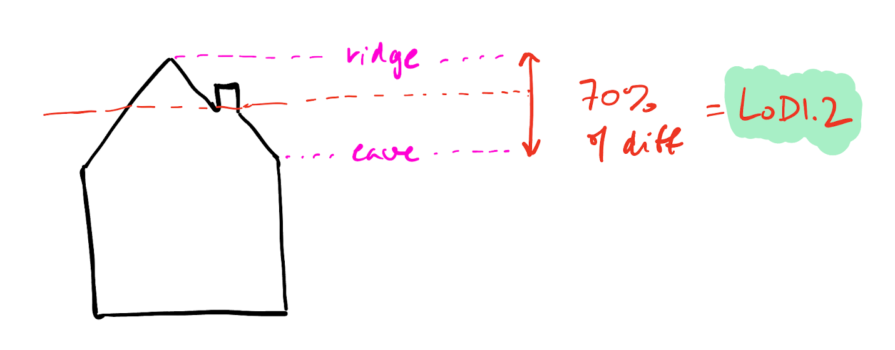

- - - 
* Table of Content
{:toc}
- - - 

## Overview

The aim of this assignment is to implement a method to generalise a 3D city model.

In short, you have to write a program that reads any CityJSON file that contains buildings in LoD 2.2, create the new LoD 1.3 buildings based on the 2.2 ones and output a new file containing both LoDs for each building.

Everything should be implemented in C++ with the help of any packages from the [CGAL](https://www.cgal.org) library. You are also free to use any other external libraries, but only for reading and writing files, such as Niels Lohmann's [JSON for Modern C++](https://github.com/nlohmann/json) library.

### Defining LoD 1.3

LoD 1.3 (see image above) merges groups of adjacent roof polygons into single polygons that are horizontal. For every newly created roof polygon, its height should be set at 70% of the difference between the eave and the ridge. The ground should be kept at the height of the ground of the LoD 2.2.

{:width="600px"}

For more details about the different LoDs, you can read this paper:

<strong>An improved LOD specification for 3D building models</strong>. Filip Biljecki, Hugo Ledoux, and Jantien Stoter. <em>Computers, Environment and Urban Systems</em>, 59: 25&ndash;37, 2016.   <a href="https://repository.tudelft.nl/islandora/object/uuid:2d49a066-4e79-4608-b31f-bce54d92d0b5/datastream/OBJ/download"><i class="fas fa-file-pdf"></i> PDF</a> <a href="http://doi.org/10.1016/j.compenvurbsys.2016.04.005"><i class="fas fa-external-link-alt"></i> DOI</a> <a href="#bibBiljecki16c" data-bs-toggle="collapse"><i class="fas fa-caret-square-down"></i> BibTeX</a>
<pre class="bibtex">@inproceedings{Biljecki16c,
  author = {Biljecki, Filip and Ledoux, Hugo and Stoter, Jantien},
  booktitle = {Computers, Environment and Urban Systems},
  pages = {25--37},
  title = {An improved {LOD} specification for {3D} building models},
  year = {2016},
  vol = {59},
  doi = {10.1016/j.compenvurbsys.2016.04.005}
}</pre>

The procedure to create the LoD 1.3 model has two parts that are relatively open: (1) computing adjacent groups of roof polygons, and (2) calculating the heights of the roof eaves and ridges. Based on what you've learned in this course, you should come up with your own methodology and describe it your report, including pros and cons of that methodology.

### Input data to test your program?

You can test your code using files from the [3DBAG](https://3dbag.nl/). Note that you can use [cjio](https://github.com/cityjson/cjio) to make smaller test files by removing LoDs or creating subsets of tiles.

### Requirements for the CityJSON output

1. CityJSON version 2.0 (both for input and output)
1. Only `Building` and `BuildingPart` have to be generalised.
1. You should add the extra LoDs in the city objects where the LoD2.2 is already present, ie it could be directly for a `Building` or a `BuildingPart`.
1. The LoD 1.3 should be a `Solid` and be geometrically valid (verify this with [val3dity](https://github.com/tudelft3d/val3dity)).
1. The complete CityJSON file you produce must be schematically valid according to the CityJSON schemas [(use `cjval` to verify this)](https://validator.cityjson.org).

### Some tips

- You should consider that the buildings in a 3D city model might not be geometrically valid. So, your algorithms must deal with this (and not crash because of geometries that are not watertight or self-intersect). Reflect about this in the report.
- The CityJSON file you read as input will be syntactically valid and of version 2.0.
- The validator [cjval](https://github.com/cityjson/cjval) can be used locally to verify the syntax of the files you create, it's faster and simpler to use than the web-app.
- CGAL has many packages that can be of great help: explore!
- You can visualise the CityJSON files using [ninja.cityjson.org](https://ninja.cityjson.org/), QGIS (using the [CityJSON Loader plugin](https://plugins.qgis.org/plugins/CityJSON-loader/)), or [azul](https://github.com/tudelft3d/azul) (macOS only).

### Report

You need to include a simple report outlining your work. It should document the main steps in your methodology, explain briefly how you implemented them, and why you chose to implement them in this manner. Focus on high-level descriptions of how things work and the engineering/design choices that you made, not on explaining your code line by line. Discuss the pros and cons of your method, assess the quality of your results using different 3DBAG tiles and measure the performance of your code. We don’t expect perfect results—just document honestly what works well and what doesn’t.

We expect maximum 10 pages for the report (with plenty of figures included). Don’t forget to write your name and student number.

## Marking

{:class="table table-responsive table-sm table-hover"}
| Criterion     | Points | 
|---------------|-------:| 
| code runs without modifications   | 1 |  
| code outputs schema-valid files   | 1 |  
| LoD 1.3 quality                   | 4 |
| report                            | 4 |

## Deliverables

You have to submit a ZIP file (or another compressed format) with the following files:

1. Your source code (everything that is needed to run/compile it).
1. Your report in PDF.

Do *not* submit your assignment by email, but use this [Dropbox link](https://www.dropbox.com/request/sj9i8iu6r982xx9yw7dt).

[last updated: 2026-06-15 11:04]